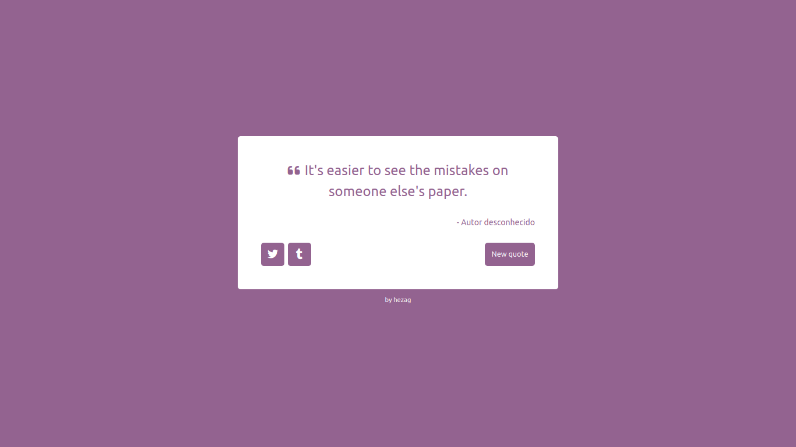

# Máquina de citação aleatória

Esta aplicação apresenta uma máquina de citação, onde diferentes citações são geradas com possibilidade de compartilhamento nas redes Twitter e Tumblr. Este projeto foi desenvolvido para obter a certificação em Bibliotecas de Desenvolvimento Front-End na plataforma freeCodeCamp.

##  :gear: Tecnologias

- HTML
- CSS
- JavaScript
- React
- Redux

##  :art: Layout

